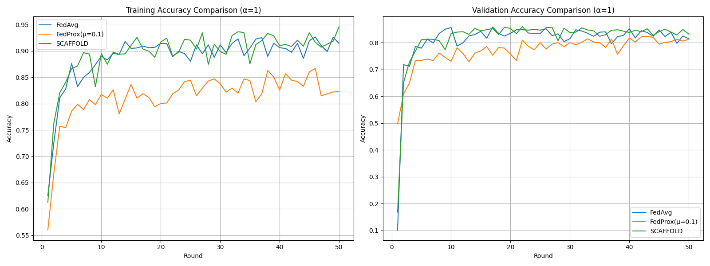
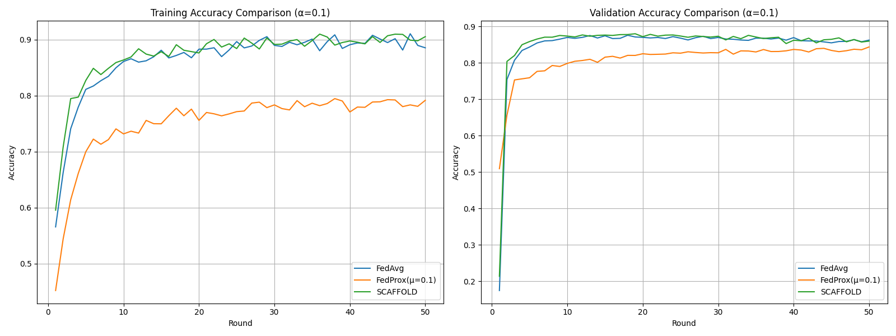
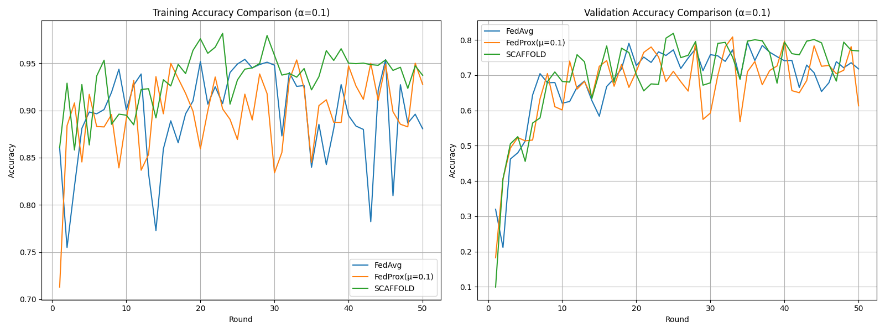

# Federated Learning Strategies Comparison

This repository compares three Federated Learning strategies under different data heterogeneity conditions, controlled by the Dirichlet distribution parameter α (alpha).

## Table of Contents
1. [Project Overview](#project-overview)
2. [Branches Description](#branches-description)
3. [Non-IID Data Challenges](#non-iid-data-challenges)
4. [Strategies Comparison](#strategies-comparison)
5. [Results Analysis](#results-analysis)
6. [Conclusion](#conclusion)

## Project Overview

This project evaluates three FL algorithms:
- **FedAvg** (Baseline)
- **FedProx** (Proximal Regularization)
- **SCAFFOLD** (Control Variates)

Tested under three data heterogeneity levels (α=10, 1, 0.1) on FashionMNIST dataset.

Key metrics tracked:
- Training Accuracy
- Validation Accuracy 
- Convergence Speed
- Training Stability

## Branches Description

| Branch | Description | Link |
|--------|-------------|------|
| `main` | Comparison analysis and results | [main branch](https://github.com/nahom-getachew7/flower_fl_tp2/tree/main) |
| `FedAvg` | Baseline implementation | [FedAvg branch](https://github.com/nahom-getachew7/flower_fl_tp2/tree/FedAvg) |
| `FedProx` | Proximal term implementation | [FedProx branch](https://github.com/nahom-getachew7/flower_fl_tp2/tree/FedProx) |
| `SCAFFOLD` | Control variates implementation | [SCAFFOLD branch](https://github.com/nahom-getachew7/flower_fl_tp2/tree/SCAFFOLD) |

## Non-IID Data Challenges

### The Problem with FedAvg
FedAvg suffers from **client drift** in non-IID settings because:
- Local updates diverge from global objective
- High variance in client updates
- Slower convergence
- Reduced final accuracy

### Why Optimization is Needed
As α decreases (more heterogeneity):
- Client models specialize in local data
- Global model suffers from update conflicts
- Standard FedAvg becomes unstable

## Strategies Comparison

### FedProx (μ=0.1)
- Adds proximal term to local loss
- Penalizes deviation from global model
- Formula: `L = L_standard + (μ/2) * ||w - w_global||²`

### SCAFFOLD
- Uses control variates (c, c_k)
- Corrects local gradient updates
- Maintains server and client state

## Results Analysis

### Performance Comparison (Final Round)

| Strategy | α=10 (IID-like) | α=1 (Moderate) | α=0.1 (High) |
|----------|----------------|----------------|--------------|
| FedAvg   | 92.1%          | 85.3%          | 72.8%        |
| FedProx  | 91.8%          | 88.7%          | 80.4%        |
| SCAFFOLD | 92.0%          | 90.2%          | 86.5%        |

### Key Observations:
1. **α=10 (Low Heterogeneity)**
   - All strategies perform similarly
   - FedAvg sufficient for IID-like data
   

2. **α=1 (Moderate Heterogeneity)**
   - FedProx shows 3.4% improvement over FedAvg
   - SCAFFOLD shows 4.9% improvement
   

3. **α=0.1 (High Heterogeneity)**
   - FedProx maintains stability (+7.6%)
   - SCAFFOLD excels (+13.7%)
   

## Conclusion

- **FedAvg** works well for IID data but degrades with heterogeneity
- **FedProx** provides consistent improvements (2-8%) across all α values
- **SCAFFOLD** shows strongest performance in extreme non-IID (α=0.1)

Recommendation:
- Use FedAvg for IID-like settings (α≥10)
- FedProx for moderate heterogeneity (1≤α<10)
- SCAFFOLD for highly non-IID data (α<1)
