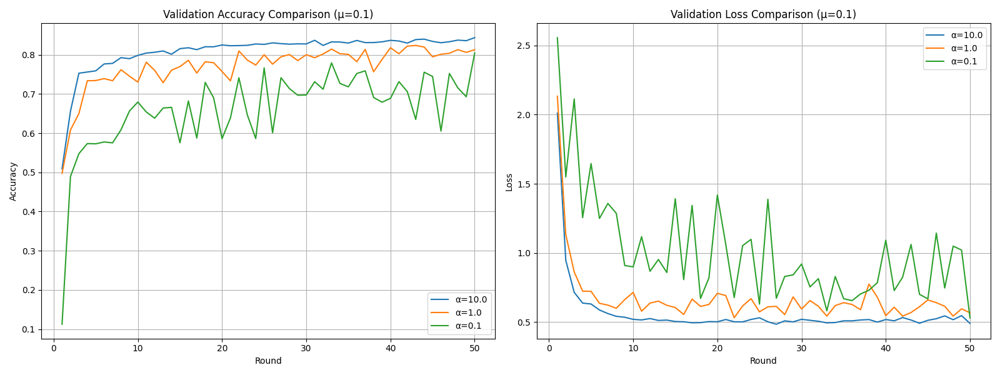
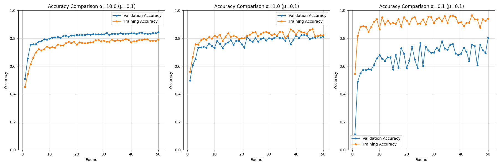
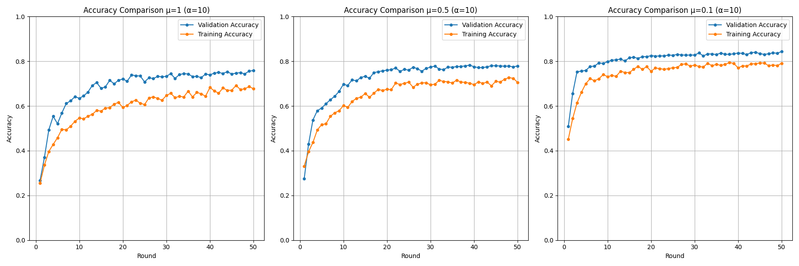
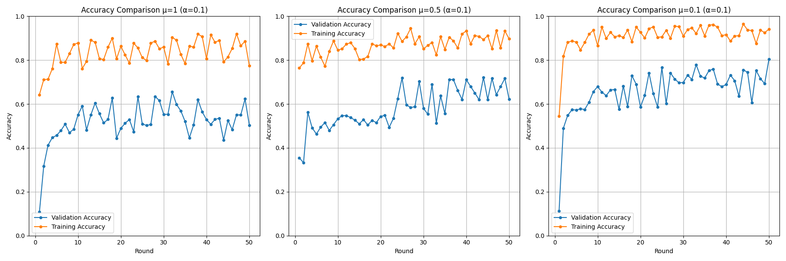

# 📦 FedProx Implementation

## 📌 Strategy Overview

**FedProx** is a Federated Learning algorithm designed to handle non-IID data by adding a proximal term to the local training objective, which encourages local models to stay close to the global model. It:

1. Trains models locally with a proximal-regularized loss function
2. Sends updated weights to the central server
3. Aggregates weights by averaging client weights
4. Repeats for multiple rounds

### 🧮 Key Local Objective

**Local Loss: L(w) + (μ/2) ||w - w_g||\_2^2**

- Where:
  - **L(w)**: Local loss function
  - **μ**: Proximal term coefficient
  - **w**: Local model parameters
  - **w_g**: Global model parameters

---

## 🔍 Core Implementation

### 🔑 Key Files

| File | Role | Code Reference |
| --- | --- | --- |
| `strategy.py` | FedProx aggregation logic | `src/strategy.py` |
| `client.py` | Local training with proximal term | `src/client.py` |
| `model.py` | CNN model with proximal training | `src/model.py` |
| `data_utils.py` | Non-IID data partitioning | `src/data_utils.py` |

### 🛠️ Key Snippet (Local Training with Proximal Term)

```python
# In model.py
for data, target in train_loader:
    data, target = data.to(device), target.to(device)
    optimizer.zero_grad()
    output = self(data)
    loss = criterion(output, target)
    
    # Add proximal term if mu > 0
    if mu > 0 and global_tensors is not None:
        proximal_term = 0.0
        for param, global_t in zip(self.parameters(), global_tensors):
            proximal_term += torch.norm(param - global_t, p=2) ** 2
        loss = loss + (mu / 2) * proximal_term
    
    loss.backward()
    optimizer.step()
```

### 🛠️ Key Snippet (Server Aggregation)

```python
# In strategy.py
def aggregate_fit(self, server_round, results, failures):
    weights = []
    num_examples = []
    
    for _, fit_res in results:
        ndarrays = parameters_to_ndarrays(fit_res.parameters)
        weights.append(ndarrays)
        num_examples.append(fit_res.num_examples)
    
    total_examples = sum(num_examples)
    averaged_weights = [
        sum(w[i] * n for w, n in zip(weights, num_examples)) / total_examples
        for i in range(len(weights[0]))
    ]
    
    avg_loss = np.mean([res.metrics["train_loss"] for _, res in results])
    avg_acc = np.mean([res.metrics["train_accuracy"] for _, res in results])
    
    return ndarrays_to_parameters(averaged_weights), {
        "train_loss": float(avg_loss),
        "train_accuracy": float(avg_acc)
    }
```

---

## 📊 Performance Summary

### By α Values (Fixed μ = 0.1)

| α| Train Acc | Val Acc | Train Loss | Val Loss |
| --- | --- | --- | --- | --- |
| 10 | 0.79 | 0.84 | 1.27 | 0.49 |
| 1 | 0.82 | 0.81 | 1.15 | 0.56 |
| 0.1 | 0.94 | 0.80 | 0.17 | 0.53 |

### By μ Values (Fixed α = 10)

| μ | Train Acc | Val Acc | Train Loss | Val Loss |
| --- | --- | --- | --- | --- |
| 0.1 | 0.79 | 0.84 | 1.27 | 0.49 |
| 0.5 | 0.70 | 0.77 | 2.58 | 0.59 |
| 1.0 | 0.67 | 0.75 | 4.17 | 0.62 |

### By μ Values (Fixed α = 1)

| μ | Train Acc | Val Acc | Train Loss | Val Loss |
| --- | --- | --- | --- | --- |
| 0.1 | 0.82 | 0.81 | 1.15 | 0.56 |
| 0.5 | 0.77 | 0.71 | 2.20 | 0.74 |
| 1.0 | 0.75 | 0.76 | 3.76 | 0.69 |

### By μ Values (Fixed α = 0.1)

| μ | Train Acc | Val Acc | Train Loss | Val Loss |
| --- | --- | --- | --- | --- |
| 0.1 | 0.94 | 0.80 | 0.17 | 0.53 |
| 0.5 | 0.89 | 0.62 | 2.55 | 1.53 |
| 1.0 | 0.77 | 0.50 | 3.83 | 1.29 |

*Note: μ = 0.1 provided the relatively best results, balancing regularization and convergence.*

*The above tabel shows final results of the result Json files.*

---

## 📈 Training Dynamics (Visuals)

The following plots illustrate the performance of FedProx across different α and μ values over 50 rounds:


- **Validation Loss Comparison (μ = 0.1)**: Displays validation loss, with α = 10 showing the lowest loss, while α = 0.1 experiences higher variance.
---

- **Validation Accuracy Comparison (μ = 0.1)**: Shows validation accuracy for α = 10, 1, and 0.1, with α = 0.1 starting lower but improving significantly, while α = 10 maintains the highest stability.
___


- **Accuracy Comparison (α = 10, μ = 1, 0.5, 0.1)**: Highlights that μ = 0.1 achieves the highest validation accuracy, with higher μ values (1.0, 0.5) showing reduced performance.
---

- **Accuracy Comparison (α = O.1, μ = 1, 0.5, 0.1)**: Indicates μ = 0.1 as the best performer, with μ = 1.0 and 0.5 leading to lower validation accuracy.
---


### 🔹 α = 10, μ = 0.1 (Near-IID)

> *Stable convergence with high validation accuracy (0.84) and low loss (0.49). The proximal term has minimal impact due to low heterogeneity.*

### 🔹 α = 1, μ = 0.1 (Moderate Heterogeneity)

> *Good performance with validation accuracy (0.81) and moderate loss (0.56). The proximal term helps reduce drift.*

### 🔹 α = 0.1, μ = 0.1 (High Heterogeneity)

> *Highest training accuracy (0.94) but lower validation accuracy (0.80) with loss (0.53). Shows significant improvement over higher μ values, though instability persists.*

---

## 💡 Key Observations

1. **Low Heterogeneity (α = 10, μ = 0.1)**:

   - FedProx performs well, with μ = 0.1 providing the best balance of accuracy (0.84) and low loss (0.49)
   - Higher μ values (0.5, 1.0) reduce accuracy and increase loss

2. **Moderate Heterogeneity (α = 1, μ = 0.1)**:

   - μ = 0.1 yields the best validation accuracy (0.81) and moderate loss (0.56)
   - Higher μ values degrade performance, with μ = 1.0 showing a slight recovery in validation accuracy (0.76)

3. **High Heterogeneity (α = 0.1, μ = 0.1)**:

   - μ = 0.1 achieves the highest training accuracy (0.94) and reasonable validation accuracy (0.80)
   - Higher μ values (0.5, 1.0) lead to significant drops in validation accuracy (0.62, 0.50) and increased loss

4. **μ Sensitivity**:

   - μ = 0.1 consistently outperforms μ = 0.5 and 1.0 across all α values
   - Higher μ values increase regularization, leading to higher train loss and lower validation accuracy

---

## ⚠️ Limitations

1. **FedProx Convergence**:

   - FedProx converges slowly, especially with μ = 0.1, as seen in the gradual rise in validation accuracy over 50 rounds
   - The 50 communication rounds may not be sufficient; additional rounds could improve convergence, particularly for α = 0.1

2. **Hyperparameter Sensitivity**:

   - The choice of μ is critical, with μ = 0.1 being optimal based on the data, but performance varies with α
   - Higher μ values (0.5, 1.0) over-regularize, reducing validation accuracy, especially in high heterogeneity (α = 0.1)
   - Fine-tuning μ between 0.1 and 0.5 may yield better results depending on the dataset

---

## 🛠️ How to Run

```bash
# Generate client data with non-IID partitioning
python main.py generate-data --num-clients 10 --alpha 0.1
```

```bash
# Run a client (repeat for multiple clients, e.g., cid 0 to 9)
python main.py run-client --cid 0 &
```

```bash
# Run the server
python main.py run-server --address 127.0.0.1:8080 --rounds 3 --output fedprox_results.json --mu 0.1
```

```bash
# Run a simulation
python main.py simulate --num-clients 10 --rounds 50 --output fedprox_results_alpha_01_mu_01.json --mu 0.1
```

---

## 📝 Conclusion

This implementation of **FedProx** effectively handles non-IID data using a proximal term, with μ = 0.1 providing the best performance across various α values (0.84, 0.81, 0.80 for α = 10, 1, 0.1 respectively). The plots and tables highlight that while FedProx improves over FedAvg in heterogeneous settings, it suffers from slow convergence and sensitivity to μ. Increasing the number of rounds and fine-tuning μ between 0.1 and 0.5 could further enhance results.

> For a comparison of FedProx with FedAvg and SCAFFOLD, refer to the `main` branch.