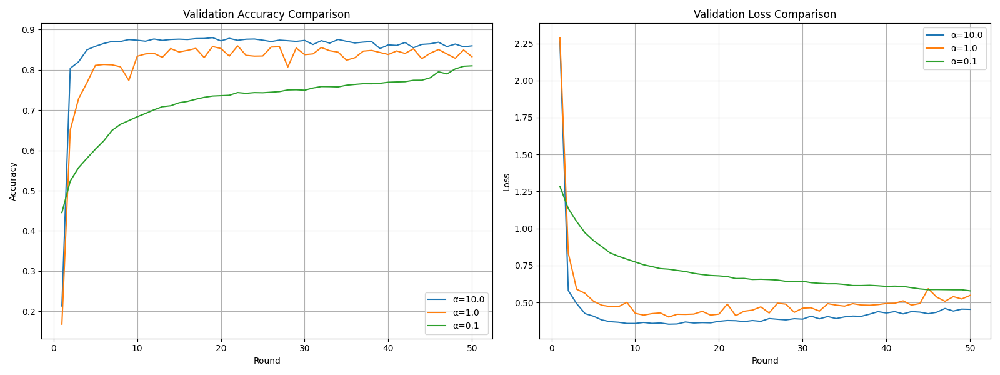

# 📦 Federated Averaging (FedAvg) Implementation

## 📌 Strategy Overview

**FedAvg** is the baseline Federated Learning algorithm that:
1. Trains models locally on each client
2. Sends updated weights to the central server
3. Averages weights from all participating clients
4. Repeats for multiple rounds

### 🧮 Key Equation

**w<sub>t+1</sub> = (1/K) * Σ [k=1 to K] w<sub>t</sub><sup>(k)</sup>**

**Where:**  
- **K**: Number of clients  
- **w<sub>t</sub><sup>(k)</sup>**: Model weights from client **k** at round **t**  

---

## � Branch Contents

This branch contains the full implementation of FedAvg with modular structure and JSON results per heterogeneity level (α):

```
FedAvg/
├── src/
│   ├── client.py       # Local training logic
│   ├── server.py       # Weight averaging
│   └── strategy.py     # FedAvg algorithm implementation
├── results.json        # Results files...
```

---

## 🔍 Core Implementation

### 🔑 Key Files

| File          | Role                 | Code Reference                     |
|---------------|----------------------|------------------------------------|
| `strategy.py` | Aggregation logic    | [`src/strategy.py`](src/strategy.py) |
| `client.py`   | Local training (SGD) | [`src/client.py`](src/client.py)     |

### � Key Snippet (Weight Averaging)

```python
# In strategy.py
def aggregate_fit(self, results, ...):
    weights = [parameters_to_ndarrays(r.parameters) for _, r in results]
    .
    .
    .
    averaged_weights = [
            sum(w[i] * n for w, n in zip(weights, num_examples)) / total_examples
            for i in range(len(weights[0]))
        ]
    return ndarrays_to_parameters(averaged_weights), {
            "train_loss": float(avg_loss),
            "train_accuracy": float(avg_acc)
        }
```

---

## 📊 Performance Summary by α Values

| α Value | Train Acc | Val Acc | Train Loss | Val Loss |
|---------|-----------|---------|------------|----------|
| 10      | 0.88      | 0.86    | 0.37       | 0.48     |
| 1       | 0.91      | 0.81    | 0.29       | 0.53     |
| 0.1     | 0.88      | 0.71    | 0.33       | 2.29     |

---

## 📈 Training Dynamics (Visuals)





### 🔹 α = 10 (Near-IID)

> *Stable convergence with low variance. FedAvg performs optimally under near-IID conditions.*

---

### 🔹 α = 1 (Moderate Heterogeneity)

> *Slightly unstable training. Some client drift appears. Accuracy decreases moderately.*

---

### 🔹 α = 0.1 (High Heterogeneity)

> *Significant divergence. Training becomes noisy and unstable. FedAvg struggles to converge.*

---

## 💡 Key Observations

1. **Low Heterogeneity (α = 10)**:
   - FedAvg performs reliably
   - Training is smooth and centralized averaging is effective

2. **Moderate Heterogeneity (α = 1)**:
   - FedAvg starts to suffer from client drift
   - Results still usable but suboptimal

3. **High Heterogeneity (α = 0.1)**:
   - Client updates diverge due to local data imbalance
   - Training becomes unstable, with much lower validation accuracy

---

## 🛠️ How to Run

```bash
# To generate client data
python main.py generate-data --num-clients 10 --alpha 0.1  #give the needed alpha value
```
```bash
# To run the CLI client
python main.py run-client --cid=0 &   #starting 0 upto 9
```
```bash
# To run server using CLI implementation 
python main.py run-server --rounds 3 --output FeddProx_realtime_implementaion.json  # give the output file and number of rounds
```

```bash
# To run simulation 
python main.py simulate --num-clients 10 --rounds 50 --output result_alpha_01_mu_05.json
#note that this also works mimicing the real enviroment and does the client and server connection within its self
```


---

## 📝 Conclusion

This branch demonstrates a clean and modular implementation of **Federated Averaging (FedAvg)**. While FedAvg performs well on IID or mildly non-IID data (high α), it **fails to maintain convergence** on highly heterogeneous data (low α), confirming its **sensitivity to client drift**. This motivates the need for more robust strategies like **FedProx** and **SCAFFOLD**, which are explored in other branches of this project.

> For a comparison of FedAvg with FedProx and SCAFFOLD, refer to the [`main` branch](https://github.com/your-repo/tree/main).