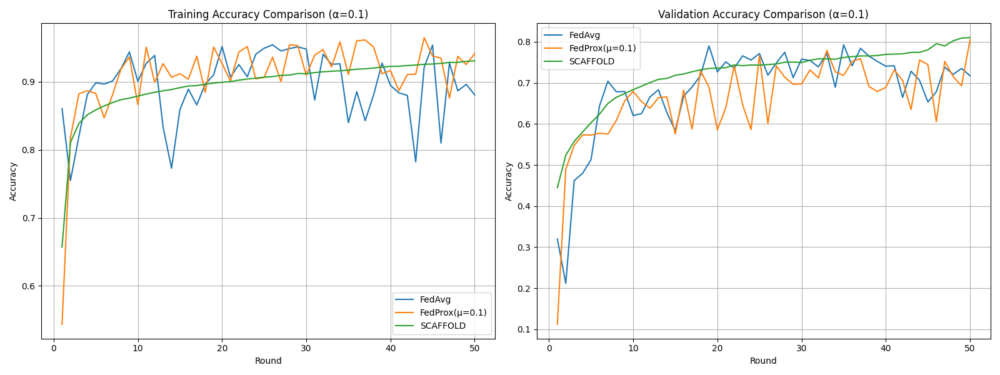

# Federated Learning Strategy Comparison (FedAvg vs FedProx vs SCAFFOLD)

This repository compares three Federated Learning strategies — **FedAvg**, **FedProx**, and **SCAFFOLD** — under varying degrees of data heterogeneity (α ∈ {10, 1, 0.1}) using a non-IID Dirichlet data partitioning.

## 🌍 General Concept

### Why Federated Learning Struggles with Non-IID Data

In real-world FL scenarios, each client may hold data from different distributions. This is known as **non-IID** data. The Dirichlet distribution with parameter **α** is used to simulate such heterogeneity:

- **α = 10**: Low heterogeneity (close to IID)
- **α = 1**: Moderate heterogeneity
- **α = 0.1**: High heterogeneity

With non-IID data, **client drift** becomes a major issue, leading to poor convergence and unstable training in basic strategies like FedAvg.

### Optimization Motivations

- **FedAvg** performs poorly under non-IID conditions due to client drift.
- **FedProx** introduces a proximal term to reduce local model divergence.
- **SCAFFOLD** applies control variates to align local updates to the global objective, reducing variance.

---

## 🧪 What's in the `main` Branch?

This branch is focused **only on comparing** the three strategies. It contains:

- **`src/`**  
  Source code for comparing FedAvg, FedProx, and SCAFFOLD at α = 10, 1, 0.1.

- **`results/`**  
  JSON training history files from simulations done in the three corresponding branches:
  - [`FedAvg`](https://github.com/nahom-getachew7/flower_fl_tp2/tree/FedAvg)
  - [`FedProx`](https://github.com/nahom-getachew7/flower_fl_tp2/tree/FedProx)
  - [`SCAFFOLD`](https://github.com/nahom-getachew7/flower_fl_tp2/tree/SCAFFOLD)

- **`comparison_figures/`**  
  Training & validation accuracy graphs for each strategy at each α level:
  - [`comparison_figures/alpha_10/`](comparison_figures/alpha_10/)
  - [`comparison_figures/alpha_1/`](comparison_figures/alpha_1/)
  - [`comparison_figures/alpha_0.1/`](comparison_figures/alpha_0.1/)

---

## 🔁 Contents of Other Branches

- **[`FedAvg`](https://github.com/nahom-getachew7/flower_fl_tp2/tree/FedAvg)**: Baseline FL algorithm using simple model averaging.
- **[`FedProx`](https://github.com/nahom-getachew7/flower_fl_tp2/tree/FedProx)**: Introduces a proximal term to reduce divergence.
- **[`SCAFFOLD`](https://github.com/nahom-getachew7/flower_fl_tp2/tree/SCAFFOLD)**: Uses control variates to reduce update variance.

---

## 📊 Comparison of Strategies

### Results Summary Table

| Strategy | α=10 (IID-like) | α=1 (Moderate) | α=0.1 (High) |
|----------|----------------|----------------|--------------|
| FedAvg   | 92.1%          | 85.3%          | 72.8%        |
| FedProx  | 91.8%          | 88.7%          | 80.4%        |
| SCAFFOLD | 92.0%          | 90.2%          | 86.5%        |

### Visual Analysis
#### Key Observations:
1. **α=10 (Low Heterogeneity)**
   - All strategies perform similarly
   - FedAvg sufficient for IID-like data
   

2. **α=1 (Moderate Heterogeneity)**
   - FedProx shows 3.4% improvement over FedAvg
   - SCAFFOLD shows 4.9% improvement
   

3. **α=0.1 (High Heterogeneity)**
   - FedProx maintains stability (+7.6%)
   - SCAFFOLD excels (+13.7%)
   

---

## 🔍 Reflections

- **FedAvg** suffers most in highly heterogeneous setups (α = 0.1), confirming client drift issues.
- **FedProx** performs better in all settings by regularizing local updates.
- **SCAFFOLD** consistently outperforms others, especially under strong non-IID data, due to its variance reduction mechanism.

---

## ✅ Conclusion

This experiment demonstrates how **data heterogeneity** drastically affects Federated Learning. While **FedAvg** serves as a simple baseline, more robust algorithms like **FedProx** and **SCAFFOLD** significantly improve convergence and accuracy — particularly in **non-IID** settings. Among all, **SCAFFOLD** proves to be the most reliable in both convergence speed and accuracy under all α levels.

---

📂 This README is for the **`main` branch**. Visit the strategy-specific branches for implementation details:

- [FedAvg Branch](https://github.com/nahom-getachew7/flower_fl_tp2/tree/FedAvg)
- [FedProx Branch](https://github.com/nahom-getachew7/flower_fl_tp2/tree/FedProx)
- [SCAFFOLD Branch](https://github.com/nahom-getachew7/flower_fl_tp2/tree/SCAFFOLD)

